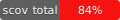

# VexUF: Medical Records Management Web Service

Welcome to VexUF, a web service built using Rails and React that provides a secure and user-friendly interface for managing medical records. VexUF allows patients, doctors, nurses, and other authorized personnel to access, update, and organize medical information efficiently.

## Features

- **User Authentication**: Secure authentication system ensures only authorized users can access patient records.
- **Role-Based Access Control**: Different user roles (patients, doctors, nurses, administrators) with specific permissions tailored to their responsibilities.
- **Patient Profile Management**: Patients can view and update their personal information, medical history, prescriptions, and appointments.
- **Doctor Dashboard**: Doctors can access patient records, update treatment plans, add notes, and communicate securely with patients.
- **Nurse Interface**: Nurses can manage patient intake, update vital signs, record medications administered, and schedule appointments.
- **Appointment Scheduling**: Schedule and manage appointments efficiently, with reminders and notifications for patients and staff.
- **Document Management**: Upload, store, and access medical documents securely, ensuring compliance with privacy regulations.
- **Search and Filtering**: Easily find patient records using advanced search and filtering options.
- **Responsive Design**: User-friendly interface optimized for desktop and mobile devices.

## Installation

To run VexUF locally, follow these steps:

1. Clone this repository to your local machine.
2. Navigate to the project directory.
3. Install dependencies by running `bundle install` for Rails dependencies and `yarn install` for React dependencies.
4. Set up the database by running `rails db:create db:migrate db:seed` to create the database, run migrations, and seed the data.
5. Start the Rails server with `bin/dev`.
6. Open your browser to visit `http://localhost:3000`.

## Configuration

TODO: add steps for configurations

## Contributing

We welcome contributions from the community to improve VexUF. To contribute:

1. Fork the repository.
2. Create a new branch for your feature or bug fix.
3. Make your changes and commit them with descriptive messages.
4. Push your changes to your fork.
5. Submit a pull request to the `main` branch of the original repository.

## License

VexUF is licensed under the [MIT License](LICENSE).

## Support

For questions, issues, or feature requests, please [open an issue](https://github.com/yourusername/VexUF/issues) on GitHub.

#### Coverage

**Spec**

**Jest**

